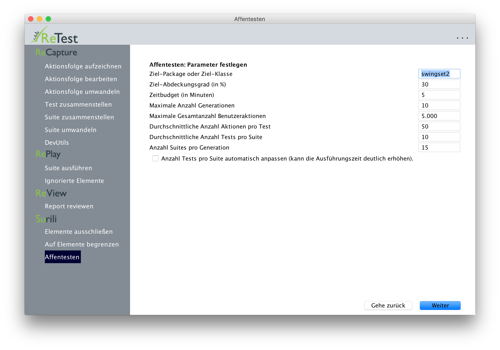

Den Affen konfigurieren
=======================

Auf der dritten Maske des Wizard kann die wichtigsten Konfigurationparameter des Affen festlegen:

* **Das Ziel-Package oder die Ziel-Klasse:** Hier können Sie angeben, für welches Packet oder welche Java-Klasse 
  der Affe versuchen soll die Code-Abdeckung der Tests zu optimieren.
  Sie können hier einen beliebigen Präfix angeben.
* **Ziel-Abdeckungsgrad (in %):** Hier können Sie angeben, welchen Abdeckungsgrad der Affe versuchen soll für das konfigurierte Packet oder die Klasse zu erreichen.
  Wir der Abdeckungsgrad erreicht oder überschritten, so beendet der Affe das Testen.
* **Zeitbudget:** Hier können Sie bspw. angeben, ob der Affe die ganze Nacht oder nur 2 Stunden testen soll.
* **Maximale Anzahl Generationen:** Hier können Sie angeben, wie viele Generationen der zugrunde liegende Genetische Algorithmus verwenden darf.
* **Maximale Gesamtanzahl Benutzeraktionen:** Ein weiteres Abbruchkriterium.
* **Durchschnittliche Anzahl Aktionen pro Test:** Hier können Sie wählen, wie lang die erzeugten Tests im Schnitt sein sollen. 
  Kürzere Tests sind einfacher nachzuvollziehen, längere Tests haben eine größere Abdeckung und sind effizienter und einfacher zu erzeugen.
* **Durchschnittliche Anzahl Tests pro Suite:** Hier können Sie wählen, wie groß die erzeugte Suite ca. sein soll.
  Kürzere Suites sind im nächtlichen CI-Prozess schneller aber schwieriger zu generieren.
* **Anzahl Suites pro Generation:** Hier können Sie angeben, wie groß eine Generationen des zugrunde liegenden Genetischen Algorithmus sein darf.
* **Anzahl Tests pro Suite automatisch anpassen:** Hier versucht unser Algorithmus heuristisch die Anzahl der Tests pro Suite auf die Anzahl der Interaktionselemente anzupassen.

Mit einem Klick auf "Weiter" kommt man zur letzten Maske -- zum Starten des [Affentesten](affentesten.md).